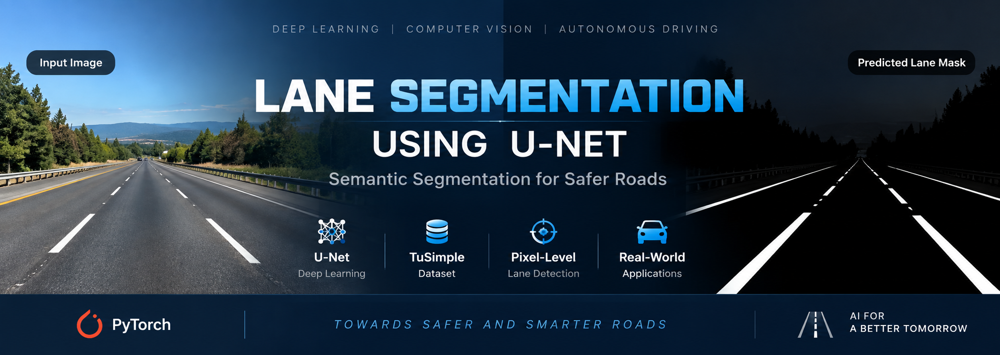
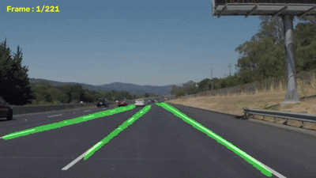
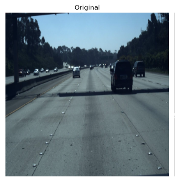
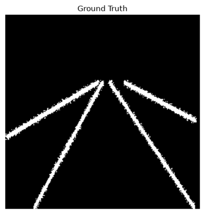
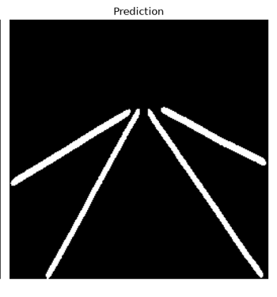
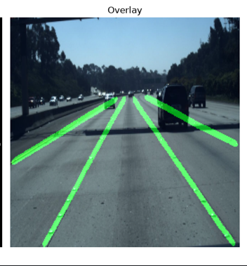
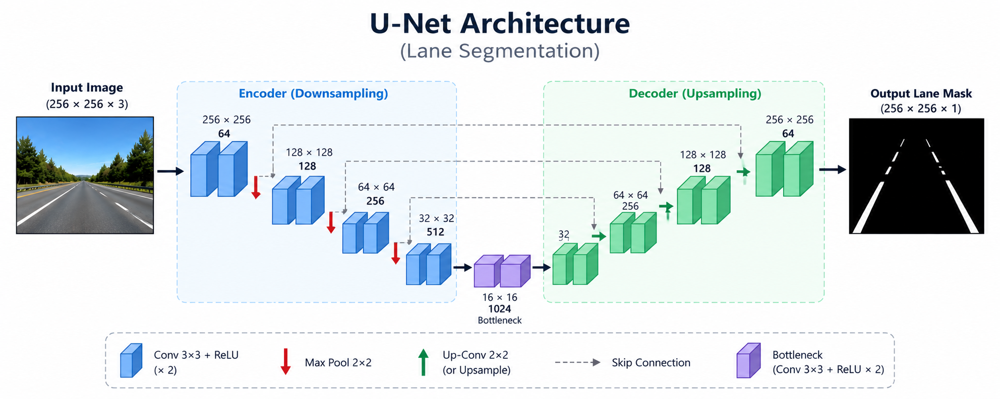

# 🚗 Lane Segmentation Using U-Net

<p align="center">
  
</p>

<p align="center">
Semantic lane segmentation using a custom <b>U-Net</b> architecture implemented in <b>PyTorch</b>. The model performs pixel-level lane detection on road images and videos, making it suitable for autonomous driving perception tasks.
</p>

---

## 📌 Project Overview

This project implements a complete semantic lane segmentation pipeline using a custom U-Net architecture. The model is trained on the **TuSimple Preprocessed Lane Detection Dataset** and is capable of generating accurate binary lane masks from both images and videos.

The repository includes:

- Dataset preprocessing
- Model training
- Evaluation pipeline
- Image inference
- Video inference
- Visualization and comparison tools

---

## ✨ Features

- Custom U-Net architecture implemented from scratch
- Lane segmentation for road images
- Video lane segmentation
- Evaluation using standard segmentation metrics
- Original vs Ground Truth vs Prediction comparison
- Easy-to-read modular PyTorch code
- GPU and CPU support

---

## 🎥 Demo

<p align="center">

</p>

---

## 📸 Sample Results

| Original | Ground Truth |
|----------|--------------|
|  |  |

| Prediction | Overlay |
|------------|---------|
|  |  |

---

# 📊 Model Performance

The trained U-Net model was evaluated on the **TuSimple Test Dataset**.

| Metric | Score |
|---------|------:|
| Dice Score | **0.7829** |
| IoU Score | **0.6467** |
| Precision | **0.7647** |
| Recall | **0.8039** |
| F1 Score | **0.7829** |
| Pixel Accuracy | **0.9770** |

---

# 🗂 Dataset

**Dataset:** TuSimple Lane Detection Dataset (Preprocessed)

Download Link:

https://www.kaggle.com/datasets/rangalamahesh/preprocessed-1

Dataset Structure

```text
dataset/
│
├── train/
├── val/
└── test/
```

---

# 🏗 Model Architecture

The segmentation model follows the standard U-Net architecture consisting of:

- Encoder
- Bottleneck
- Decoder
- Skip Connections

<p align="center">

</p>

---

# 🛠 Technologies Used

- Python
- PyTorch
- OpenCV
- NumPy
- Albumentations
- Matplotlib

---

# 📂 Project Structure

```text
Lane-Segmentation-Using-UNet/

├── assets/
│   ├── banner.png
│   ├── demo.gif
│   ├── architecture.png
│   ├── original.png
│   ├── groundtruth.png
│   ├── prediction.png
│   └── overlay.png
│
├── comparison_outputs/
├── models/
├── outputs/
│
├── comparison.py
├── config.py
├── dataset.py
├── dataset_check.py
├── engine.py
├── evaluate.py
├── loss.py
├── metrics.py
├── model.py
├── predict.py
├── split_dataset.py
├── train.py
├── transforms.py
├── video.py
├── visualize.py
│
├── requirements.txt
└── README.md
```

---

# ⚙ Installation

Clone the repository

```bash
git clone https://github.com/Shubhambehera29/Lane-Segmentation-Using-UNet.git
```

Move into the project directory

```bash
cd Lane-Segmentation-Using-UNet
```

Install dependencies

```bash
pip install -r requirements.txt
```

---

# 🚀 Training

Train the model using

```bash
python train.py
```

The trained model will be saved inside

```text
models/
```

---

# 🖼 Image Prediction

```bash
python predict.py
```

---

# 🎬 Video Prediction

```bash
python video.py
```

---

# 📈 Model Evaluation

```bash
python evaluate.py
```

The evaluation script computes:

- Dice Score
- IoU Score
- Precision
- Recall
- F1 Score
- Pixel Accuracy

---

# 📁 Output

The project generates:

- Binary lane masks
- Overlay visualizations
- Comparison images
- Predicted videos
- Quantitative evaluation metrics

---

# 🚀 Future Improvements

- DeepLabV3+
- U-Net++
- Attention U-Net
- Real-time optimization
- TensorRT deployment
- ONNX export
- ROS2 integration for autonomous vehicles

---

# 🙌 Acknowledgements

- PyTorch
- OpenCV
- Albumentations
- TuSimple Lane Detection Dataset

---

# 📜 License

This project is licensed under the **MIT License**.